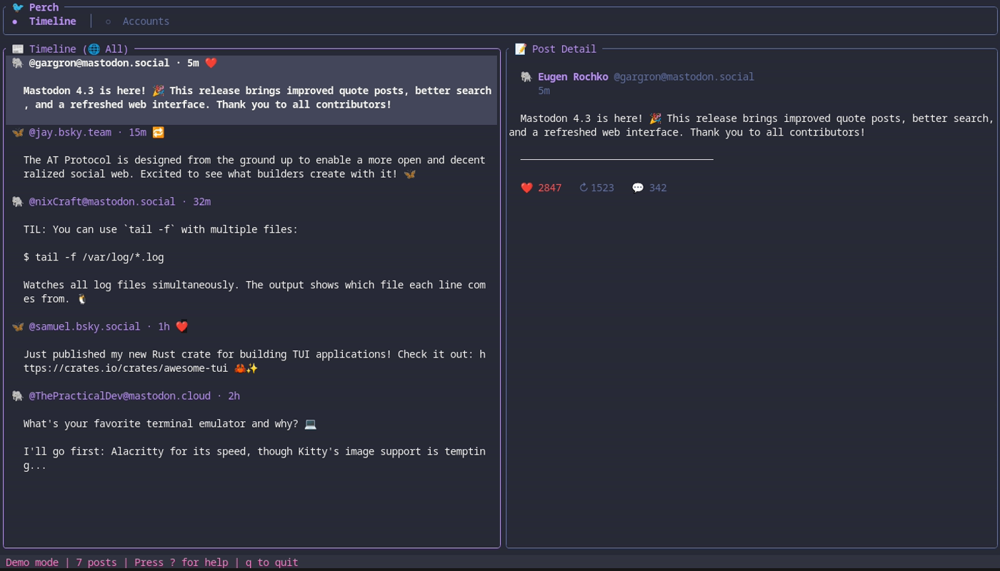
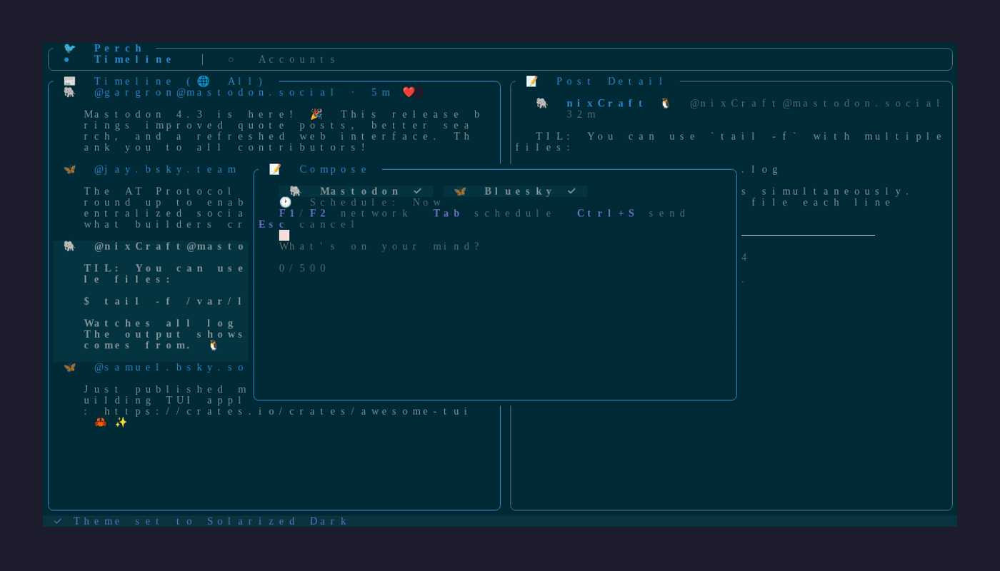
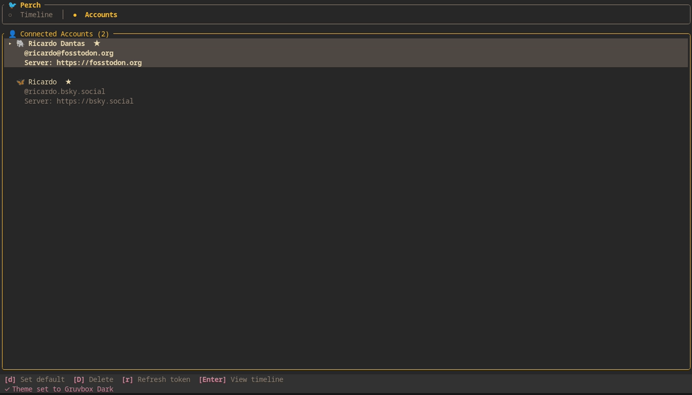
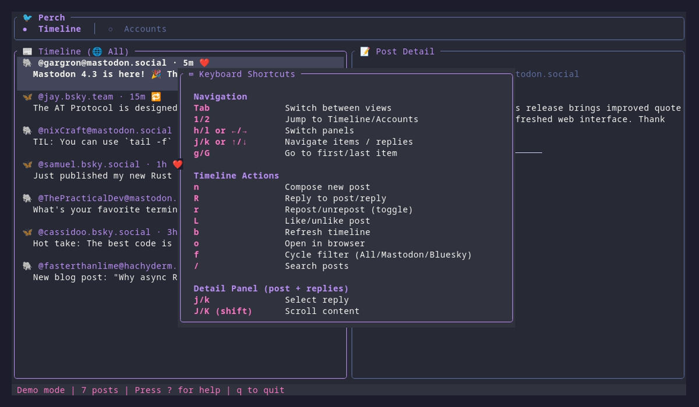
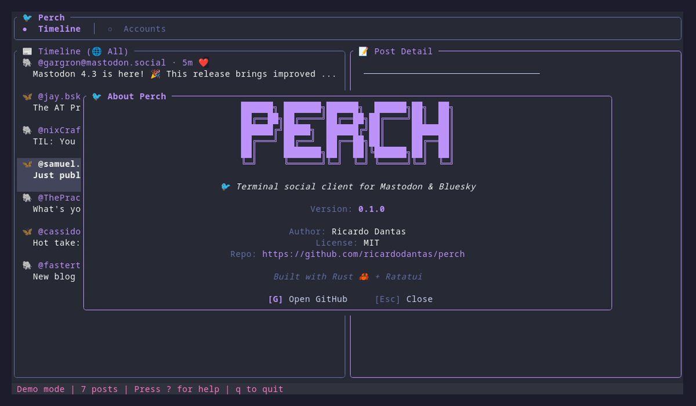

<p align="center">
  
</p>

<h1 align="center">
  🐦 Perch
</h1>

<p align="center">
  <strong>A beautiful terminal social client for Mastodon and Bluesky</strong>
</p>

<p align="center">
  <i>Read, post, and engage across social networks — all from your terminal.</i>
</p>

<p align="center">
  <a href="https://github.com/ricardodantas/perch/releases">
    
  </a>
  <a href="https://crates.io/crates/perch">
    
  </a>
  <a href="https://github.com/ricardodantas/perch/actions">
    
  </a>
  <a href="https://github.com/ricardodantas/perch/blob/main/LICENSE">
    
  </a>
  <a href="https://rust-lang.org">
    
  </a>
</p>

<br>

## 📖 Table of Contents

- [✨ Features](#-features)
- [📸 Screenshots](#-screenshots)
- [🚀 Quick Start](#-quick-start)
- [🔐 Authentication](#-authentication)
- [💻 Usage](#-usage)
- [⌨️ Keybindings](#️-keybindings)
- [🎨 Themes](#-themes)
- [⚙️ Configuration](#️-configuration)
- [🏗️ Architecture](#️-architecture)
- [🔧 Building from Source](#-building-from-source)
- [🤝 Contributing](#-contributing)
- [📄 License](#-license)

<br>

## ✨ Features

<table>
<tr>
<td width="50%">

### 🐘 Mastodon Integration
Full OAuth authentication with any instance. Browse timelines, post, reply, like, and boost.

### 🦋 Bluesky Integration
AT Protocol support with app passwords. Stay connected to the decentralized social web.

### 📝 Cross-Posting
Write once, post to multiple networks simultaneously. Perfect for maintaining presence everywhere.

</td>
<td width="50%">

### 🖥️ Beautiful TUI
Gorgeous three-panel terminal interface with vim keybindings and real-time updates.

### ⚡ Powerful CLI
Script your social media with comprehensive commands. Automate posts, fetch timelines, manage accounts.

### 🔐 Secure Storage
Credentials stored safely in your system keyring. Never worry about plaintext tokens.

</td>
</tr>
</table>

<br>

### Feature Highlights

| Feature | Description |
|---------|-------------|
| 🔍 **Timeline Filtering** | View all posts or filter by network |
| 💾 **Offline Cache** | SQLite-backed cache for offline reading |
| 🎨 **15 Built-in Themes** | From Dracula to Cyberpunk |
| ⌨️ **Vim Keybindings** | Navigate like a pro |
| 📋 **Draft Support** | Save drafts for later |
| 📅 **Scheduled Posts** | Queue posts for optimal timing |
| 🔔 **Notifications** | Desktop alerts for mentions |
| 🖼️ **Media Support** | Attach images to posts |

<br>

## 📸 Screenshots

<details>
<summary><strong>Timeline View</strong> — Browse posts from all your networks</summary>
<br>

</details>

<details>
<summary><strong>Compose Post</strong> — Write once, post everywhere</summary>
<br>

</details>

<details>
<summary><strong>Accounts</strong> — Manage your connected accounts</summary>
<br>

</details>

<details>
<summary><strong>Keyboard Shortcuts</strong> — Vim-style navigation</summary>
<br>

</details>

<details>
<summary><strong>Theme Picker</strong> — 15 beautiful themes</summary>
<br>

</details>

<details>
<summary><strong>About</strong> — Version info and links</summary>
<br>

</details>

<br>

## 🚀 Quick Start

### Installation

#### macOS

```bash
# Homebrew (recommended - fast, pre-built binary)
brew install ricardodantas/tap/perch
```

#### Linux

```bash
# Homebrew (recommended)
brew install ricardodantas/tap/perch

# Or via Cargo
cargo install perch
```

#### Windows

```bash
# Via Cargo (requires Rust toolchain)
cargo install perch
```

Or download `perch-*-x86_64-pc-windows-msvc.zip` from [GitHub Releases](https://github.com/ricardodantas/perch/releases).

#### From Source

```bash
git clone https://github.com/ricardodantas/perch
cd perch
cargo install --path .
```

### First Run

1. **Add a Mastodon account:**

```bash
perch auth mastodon mastodon.social
```

2. **Or add a Bluesky account:**

```bash
perch auth bluesky
```

3. **Launch the TUI:**

```bash
perch
```

<br>

## 🔐 Authentication

### Mastodon (OAuth)

```bash
perch auth mastodon <instance>
```

This will:
1. Register Perch with your Mastodon instance
2. Open your browser for authorization
3. Ask you to paste the authorization code
4. Store credentials securely in your system keyring

**Examples:**

```bash
perch auth mastodon mastodon.social
perch auth mastodon fosstodon.org
perch auth mastodon hachyderm.io
```

### Bluesky (App Password)

```bash
perch auth bluesky
```

You'll need an [App Password](https://bsky.app/settings/app-passwords) from Bluesky settings.

**Note:** App passwords are more secure than your main password — they can be revoked individually and don't have full account access.

<br>

## 💻 Usage

### TUI Mode

```bash
perch
```

Launch the beautiful terminal interface with three-panel layout:
- **Left panel**: Accounts and filters
- **Center panel**: Timeline/feed
- **Right panel**: Post details and media

### CLI Commands

#### Posting

```bash
# Post to all configured networks
perch post "Hello world!"

# Post to specific networks
perch post "Hello Fediverse!" --to mastodon
perch post "Hello everyone!" --to mastodon,bluesky

# Post with content warning
perch post "Spoiler content" --cw "Movie spoilers"

# Post with media
perch post "Check this out!" --media ~/photo.jpg
```

#### Scheduled Posts

```bash
# Schedule a post for later
perch post "Good morning!" --schedule "in 2h"
perch post "Happy Friday!" --schedule "2026-02-14 09:00" --to mastodon,bluesky

# List pending scheduled posts
perch schedule list

# Cancel a scheduled post
perch schedule cancel abc123

# Process due scheduled posts (one-time)
perch schedule run

# Run scheduler daemon (continuous)
perch schedule daemon
perch schedule daemon --interval 30  # Check every 30 seconds
```

**Schedule time formats:**
- Relative: `"in 5m"`, `"in 2h"`, `"in 1d"`, `"in 30 minutes"`
- Time today: `"15:00"`, `"3pm"` (schedules for tomorrow if past)
- Date+time: `"2026-02-08 15:00"`, `"2026-02-08T15:00"`

**TUI Scheduling:**
In the compose dialog (`n`), press `Tab` to switch to the schedule input field. Type your schedule time and it validates in real-time. Press `Tab` or `Enter` to confirm, `F4` to clear.

#### Timeline

```bash
# View home timeline (all networks)
perch timeline

# View specific network
perch timeline mastodon
perch timeline bluesky

# Limit posts
perch timeline --limit 50
```

#### Account Management

```bash
# List all accounts
perch accounts

# Remove an account
perch accounts remove <account-id>
```

<br>

## ⌨️ Keybindings

### Global

| Key | Action |
|-----|--------|
| `Tab` | Switch panel |
| `?` / `F1` | Show help |
| `t` | Change theme |
| `q` | Quit |
| `Ctrl+c` | Force quit |

### Navigation

| Key | Action |
|-----|--------|
| `↑` / `k` | Move up |
| `↓` / `j` | Move down |
| `g` / `Home` | Go to first item |
| `G` / `End` | Go to last item |
| `PageUp` | Page up |
| `PageDown` | Page down |

### Timeline View

| Key | Action |
|-----|--------|
| `r` | Refresh timeline |
| `f` | Cycle filter (All/Mastodon/Bluesky) |
| `Enter` | View post details |
| `o` | Open in browser |
| `l` | Like/favorite |
| `b` | Boost/repost |
| `R` | Reply to post |

### Compose

| Key | Action |
|-----|--------|
| `n` | New post |
| `Ctrl+Enter` | Send post |
| `Alt+1` | Toggle Mastodon |
| `Alt+2` | Toggle Bluesky |
| `Esc` | Cancel |

<br>

## 🎨 Themes

Perch includes **15 beautiful themes** based on popular terminal and editor color schemes.

Press `t` in the TUI to cycle through themes.

### Available Themes

| Theme | Description |
|-------|-------------|
| 🦇 **Dracula** | Dark purple aesthetic (default) |
| 🌙 **One Dark Pro** | Atom's iconic dark theme |
| ❄️ **Nord** | Arctic, bluish color palette |
| 🐱 **Catppuccin Mocha** | Warm pastel dark theme |
| ☕ **Catppuccin Latte** | Warm pastel light theme |
| 🎸 **Gruvbox Dark** | Retro groove colors |
| 📜 **Gruvbox Light** | Retro groove, light variant |
| 🌃 **Tokyo Night** | Futuristic dark blue |
| 🌅 **Solarized Dark** | Precision colors, dark |
| 🌞 **Solarized Light** | Precision colors, light |
| 🎨 **Monokai Pro** | Classic syntax highlighting |
| 🌹 **Rosé Pine** | All natural pine with soho vibes |
| 🌊 **Kanagawa** | Inspired by Katsushika Hokusai |
| 🌲 **Everforest** | Comfortable green forest theme |
| 🌆 **Cyberpunk** | Neon-soaked futuristic theme |

<br>

## ⚙️ Configuration

Perch uses [TOML](https://toml.io) for configuration. The config file is located at:

```
~/.config/perch/config.toml
```

### Full Configuration Example

```toml
# ─────────────────────────────────────────────────────────────
# Display Settings
# ─────────────────────────────────────────────────────────────

# Theme (dracula, nord, catppuccin-mocha, etc.)
theme = "dracula"

# Enable vim-like keybindings
vim_mode = true

# Show media previews (when supported)
show_media = true

# ─────────────────────────────────────────────────────────────
# Timeline Settings
# ─────────────────────────────────────────────────────────────

# Default timeline view
default_timeline = "home"

# Number of posts to fetch
post_limit = 50

# Auto-refresh interval in seconds (0 = manual only)
refresh_interval_secs = 0

# ─────────────────────────────────────────────────────────────
# Posting Settings
# ─────────────────────────────────────────────────────────────

# Default visibility for posts
# Options: public, unlisted, private, direct
default_visibility = "public"

# Default networks to post to (when using CLI without --to)
default_networks = ["mastodon", "bluesky"]
```

<br>

## 🏗️ Architecture

```
┌─────────────────────────────────────────────────────────────┐
│                         User                                │
└─────────────────────────────────────────────────────────────┘
                              │
              ┌───────────────┴───────────────┐
              ▼                               ▼
┌─────────────────────────┐     ┌─────────────────────────┐
│     perch (TUI)         │     │     perch (CLI)         │
│  • Browse timelines     │     │  • perch post           │
│  • Compose posts        │     │  • perch timeline       │
│  • Like & boost         │     │  • perch accounts       │
│  • Switch themes        │     │  • Scriptable commands  │
└─────────────────────────┘     └─────────────────────────┘
              │                               │
              └───────────────┬───────────────┘
                              ▼
┌─────────────────────────────────────────────────────────────┐
│                      Core Library                           │
│  • api/mastodon.rs  — Mastodon OAuth + API                  │
│  • api/bluesky.rs   — AT Protocol integration               │
│  • auth/            — System keyring storage                │
│  • db.rs            — SQLite cache & drafts                 │
└─────────────────────────────────────────────────────────────┘
                              │
              ┌───────────────┴───────────────┐
              ▼                               ▼
┌─────────────────────────┐     ┌─────────────────────────┐
│   🐘 Mastodon API       │     │   🦋 Bluesky API        │
│   (Any instance)        │     │   (bsky.social)         │
└─────────────────────────┘     └─────────────────────────┘
```

### Project Structure

```
perch/
├── src/
│   ├── api/              # Network API clients
│   │   ├── mod.rs        # Unified SocialApi trait
│   │   ├── mastodon.rs   # Mastodon OAuth + REST
│   │   └── bluesky.rs    # AT Protocol client
│   ├── app/              # TUI application
│   │   ├── mod.rs
│   │   ├── state.rs      # Application state
│   │   ├── events.rs     # Key event handling
│   │   └── ui.rs         # UI rendering
│   ├── auth/             # Credential storage
│   │   └── mod.rs        # System keyring
│   ├── models/           # Data models
│   │   ├── mod.rs
│   │   ├── account.rs
│   │   ├── network.rs
│   │   └── post.rs
│   ├── config.rs         # Configuration loading
│   ├── db.rs             # SQLite database
│   ├── theme.rs          # Color themes
│   ├── lib.rs            # Library root
│   └── main.rs           # Entry point
├── Cargo.toml
└── LICENSE
```

<br>

## 🔧 Building from Source

### Requirements

- **Rust 1.85+**
- **Linux**, **macOS**, or **Windows**

### Build

```bash
# Clone the repository
git clone https://github.com/ricardodantas/perch
cd perch

# Build release binary
cargo build --release

# The binary will be at:
# target/release/perch

# Or install directly
cargo install --path .
```

### Development

```bash
# Run in development
cargo run

# Run tests
cargo test

# Run linter
cargo clippy

# Format code
cargo fmt
```

<br>

## 🤝 Contributing

Contributions are welcome! Please feel free to submit a Pull Request.

### Quick Start for Contributors

1. Fork the repository
2. Create a feature branch: `git checkout -b feature/amazing-feature`
3. Make your changes
4. Run tests: `cargo test`
5. Run clippy: `cargo clippy`
6. Format: `cargo fmt`
7. Commit: `git commit -m "Add amazing feature"`
8. Push: `git push origin feature/amazing-feature`
9. Open a Pull Request

<br>

## 📄 License

This project is licensed under the **MIT License** — see the [LICENSE](LICENSE) file for details.

---

<p align="center">
  <sub>Built with 🦀 Rust and ❤️ by <a href="https://github.com/ricardodantas">Ricardo Dantas</a></sub>
</p>
